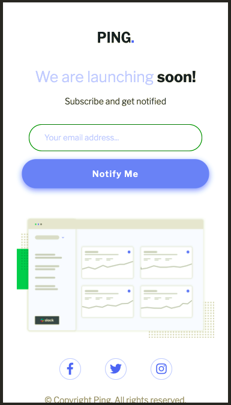
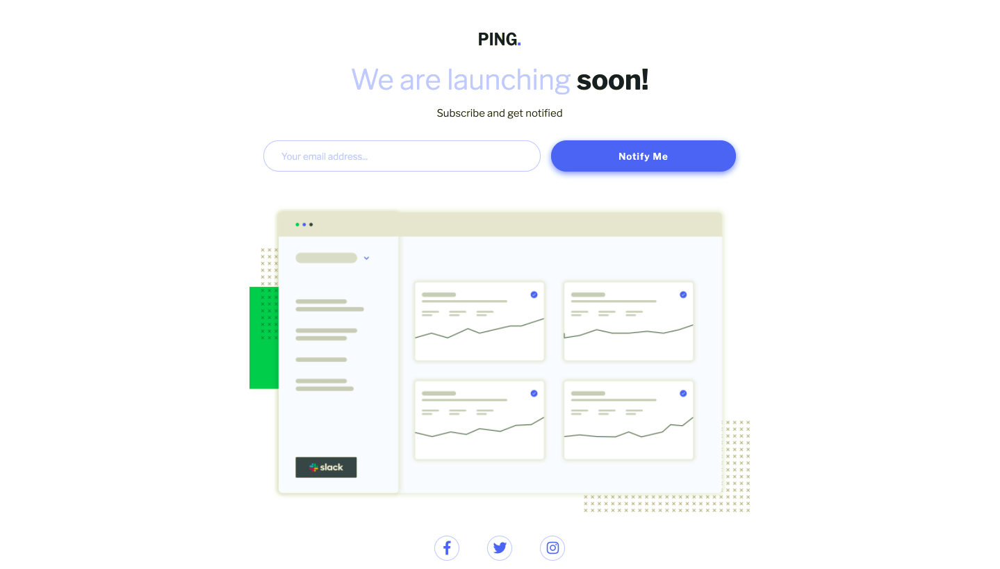
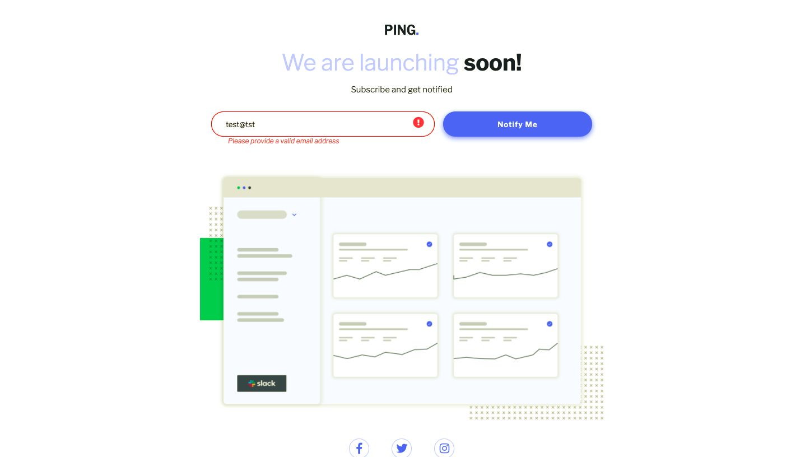

# Frontend Mentor - Ping coming soon page solution

This is a solution to the [Ping coming soon page challenge on Frontend Mentor](https://www.frontendmentor.io/challenges/ping-single-column-coming-soon-page-5cadd051fec04111f7b848da). Frontend Mentor challenges help you improve your coding skills by building realistic projects. 

## Table of contents

  - [The challenge](#the-challenge)
  - [Screenshot](#screenshot)
  - [Links](#links)
  - [Built with](#built-with)
  - [What I learned](#what-i-learned)
  - [Continued development](#continued-development)
  - [Useful resources](#useful-resources)
  - [Author](#author)
  

## Overview

### The challenge

Users should be able to:

- View the optimal layout for the site depending on their device's screen size
- See hover states for all interactive elements on the page
- Submit their email address using an `input` field
- Receive an error message when the `form` is submitted if:
	- The `input` field is empty. The message for this error should say *"Whoops! It looks like you forgot to add your email"*
	- The email address is not formatted correctly (i.e. a correct email address should have this structure: `name@host.tld`). The message for this error should say *"Please provide a valid email address"*

### Screenshot

### Links

- Solution URL: [Add solution URL here](https://github.com/Sauravionic/Frontend-MentorPing-single-column-coming-soon-page)
- Live Site URL: [Add live site URL here](https://sauravionic.github.io/Frontend-MentorPing-single-column-coming-soon-page/)

### Built with

- Semantic HTML5 markup
- CSS custom properties
- Flexbox
- Mobile-first workflow
- Media Query
- JavaScript

### What I learned

 - I got flexible with flex-basis property of flexbox
 - Knowledge about Regex
 - JavaScript DOM Manipulation

### Continued development

I'm not very comfortable when it comes to DOM Manipulation but I'm getting better at it with every project.

### Useful resources

- [Font-Awesome](https://fontawesome.com) - This helped me with font icons. I really like this website and it's icons.

## Author

- LinkedIn - [Saurav Srivastava](https://www.linkedin.com/in/saurav-srivastava-4b71b5188/)
- Frontend Mentor - [@Sauravionic](https://www.frontendmentor.io/profile/Sauravionic)
- GitHub - [Sauravionic](https://github.com/Sauravionic)
